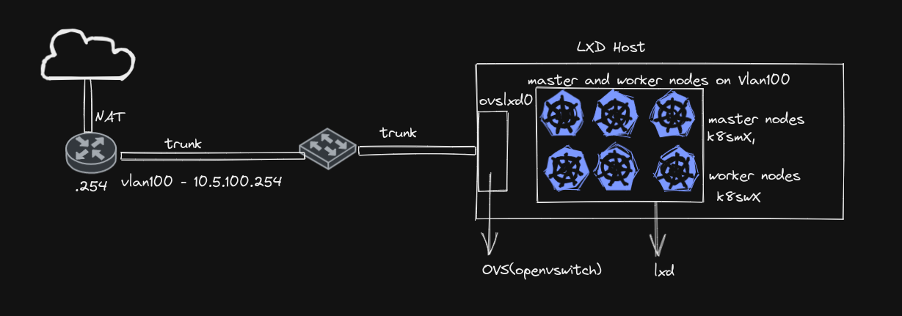

## Create Rancher Cluster with LXD

This is how I create my Rancher K8S Cluster on my homelab using ```OVS``` and ```LXD``` 

* All Kubernetes nodes configured with Static IP using ```cloud-init```
* Kubernetes nodes on Certain VLAN
* Kubernetes nodes configured to get IP statically.





## Configure Openvswitch 

* install ```openvswitch-switch```

* Create lxd managed openvswitch

```bash
$ lxc network create ovslxd0 --type=bridge bridge.driver=openvswitch
```
* Add Physical interface(trunk) to lxd managed ovs switch.

```bash
$ sudo ovs-vsctl add-port ovslxd0 enp5s0
```
*Note:* During the reboot, Pyhsical interface will not be added to the lxd managed OVS bridge automatically. So, you need script to add interface, after the Network Stack is available.

* Disable IPv4 address management and nat.

**Example bridge configuration**

```yaml
config:
  bridge.driver: openvswitch
  ipv4.address: none
  ipv4.nat: "false"
  ipv6.address: none
  ipv6.nat: "true"
description: ""
name: ovslxd0
type: bridge
used_by: []
managed: true
status: Created
locations:
- none
```

## Create Profile

```bash
lxc profile create k8sm1
cat k8sm1.yml | lxc profile edit k8sm1
```
You can create profile and set it for the rest of the Kubernetes master and worker nodes similar above.


## Create Storage

```bash
mkdir -p /data/lxd/storage-pools/lab
lxc storage create lab dir source=/data/lxd/storage-pools/lab
```

## Create Volume
We are creating additional volume that will be added to the worker nodes as data disk, which will be used by the ```Longhorn``` later.

```bash
lxc storage volume create lab k8sw1_lab_disk_2 --type=block
lxc storage volume create lab k8sw2_lab_disk_2 --type=block
lxc storage volume create lab k8sw3_lab_disk_2 --type=block
```

## Set Volume Size
```bash
lxc storage volume set lab k8sw1_lab_disk_2 size=80GiB
lxc storage volume set lab k8sw2_lab_disk_2 size=80GiB
lxc storage volume set lab k8sw3_lab_disk_2 size=80GiB
```

## Create Kubernetes Nodes

```bash
lxc launch ubuntu:20.04 k8sm1 --profile k8sm1 --vm
lxc launch ubuntu:20.04 k8sm2 --profile k8sm2 --vm
lxc launch ubuntu:20.04 k8sm3 --profile k8sm3 --vm
lxc launch ubuntu:20.04 k8sw1 --profile k8sw1 --vm
lxc launch ubuntu:20.04 k8sw2 --profile k8sw2 --vm
lxc launch ubuntu:20.04 k8sw3 --profile k8sw3 --vm
```


## List the Profiles

```console
lxc profile list
+---------+-------------------------------------+---------+
|  NAME   |             DESCRIPTION             | USED BY |
+---------+-------------------------------------+---------+
| default | Default LXD profile                 | 0       |
+---------+-------------------------------------+---------+
| k8sm1   | LXD profile for K8S Master Node - 1 | 1       |
+---------+-------------------------------------+---------+
| k8sm2   | LXD profile for K8S Master Node - 2 | 1       |
+---------+-------------------------------------+---------+
| k8sm3   | LXD profile for K8S Master Node - 3 | 1       |
+---------+-------------------------------------+---------+
| k8sw1   | LXD profile for K8S Worker Node - 1 | 1       |
+---------+-------------------------------------+---------+
| k8sw2   | LXD profile for K8S Worker Node - 2 | 1       |
+---------+-------------------------------------+---------+
| k8sw3   | LXD profile for K8S Worker Node - 3 | 1       |
+---------+-------------------------------------+---------+
```