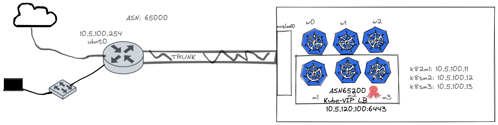
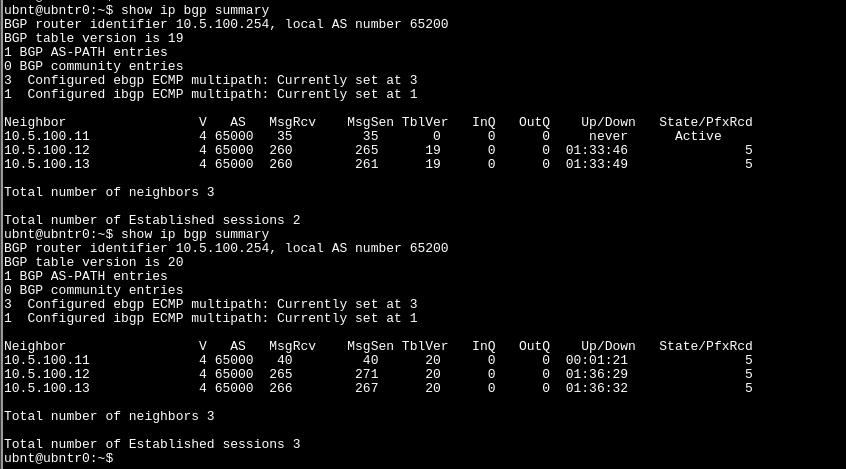

## Create HA Rancher(RKE2) Cluster with  KubeVIP 

This is how I create my HA Rancher(RKE2) K8S Cluster on my homelab using ```OVS``` and ```LXD``` 

* All Kubernetes nodes configured with Static IP using ```cloud-init```
* Kubernetes nodes on Certain VLAN
* Kubernetes nodes configured to get IP statically.


## Configure Openvswitch 

* install ```openvswitch-switch```

* Create lxd managed openvswitch

```bash
$ lxc network create ovslxd0 --type=bridge bridge.driver=openvswitch
```
* Add Physical interface(trunk) to lxd managed ovs switch.

```bash
$ sudo ovs-vsctl add-port ovslxd0 enp5s0
```
*Note:* During the reboot, Pyhsical interface will not be added to the lxd managed OVS bridge automatically. So, you need script to add interface, after the Network Stack is available.

* Disable IPv4 address management and nat.

**Example bridge configuration**

```yaml
config:
  bridge.driver: openvswitch
  ipv4.address: none
  ipv4.nat: "false"
  ipv6.address: none
  ipv6.nat: "true"
description: ""
name: ovslxd0
type: bridge
used_by: []
managed: true
status: Created
locations:
- none
```

## Create Profile

```bash
lxc profile create k8sm1
cat k8sm1.yml | lxc profile edit k8sm1
```
You can create profile and set it for the rest of the Kubernetes master and worker nodes similar above.


## Create Storage

```bash
mkdir -p /data/lxd/storage-pools/lab
lxc storage create lab dir source=/data/lxd/storage-pools/lab
```

## Create Volume
We are creating additional volume that will be added to the worker nodes as data disk, which will be used by the ```Longhorn``` later.

```bash
lxc storage volume create lab k8sw1_lab_disk_2 --type=block
lxc storage volume create lab k8sw2_lab_disk_2 --type=block
lxc storage volume create lab k8sw3_lab_disk_2 --type=block
```

## Set Volume Size
```bash
lxc storage volume set lab k8sw1_lab_disk_2 size=80GiB
lxc storage volume set lab k8sw2_lab_disk_2 size=80GiB
lxc storage volume set lab k8sw3_lab_disk_2 size=80GiB
```

## List the Profiles

```console
lxc profile list
+---------+-------------------------------------+---------+
|  NAME   |             DESCRIPTION             | USED BY |
+---------+-------------------------------------+---------+
| default | Default LXD profile                 | 0       |
+---------+-------------------------------------+---------+
| k8sm1   | LXD profile for K8S Master Node - 1 | 1       |
+---------+-------------------------------------+---------+
| k8sm2   | LXD profile for K8S Master Node - 2 | 1       |
+---------+-------------------------------------+---------+
| k8sm3   | LXD profile for K8S Master Node - 3 | 1       |
+---------+-------------------------------------+---------+
| k8sw1   | LXD profile for K8S Worker Node - 1 | 1       |
+---------+-------------------------------------+---------+
| k8sw2   | LXD profile for K8S Worker Node - 2 | 1       |
+---------+-------------------------------------+---------+
| k8sw3   | LXD profile for K8S Worker Node - 3 | 1       |
+---------+-------------------------------------+---------+
```

## Bootstrap Kubernetes Nodes
It must be bootstrap first master node. Rest of the nodes started after, Kube-VIP is configured.

```bash
lxc launch ubuntu:20.04 k8sm1 --profile k8sm1 --vm
```

Once first master node started and initialized successfully. It is necessary to configure kube-vip before running rest of the master nodes.

On the first master node:

```bash
export TAG=v0.4.2
export CONTAINERD_ADDRESS=/run/k3s/containerd/containerd.sock
export CONTAINER_RUNTIME_ENDPOINT=unix:///run/k3s/containerd/containerd.sock
export PATH=/var/lib/rancher/rke2/bin:$PATH
alias k='/var/lib/rancher/rke2/bin/kubectl --kubeconfig /etc/rancher/rke2/rke2.yaml'
crictl pull  docker.io/plndr/kube-vip:$TAG
alias kube-vip="ctr --namespace k8s.io run --rm --net-host docker.io/plndr/kube-vip:$TAG vip /kube-vip"
```

## Router Configuration(EdgeRoute X)

```console
configure
set protocols bgp 65200 parameters router-id 10.5.100.254
set protocols bgp 65200 neighbor 10.5.100.11 remote-as 65000
set protocols bgp 65200 neighbor 10.5.100.12 remote-as 65000
set protocols bgp 65200 neighbor 10.5.100.13 remote-as 65000
set protocols bgp 65200 maximum-paths ebgp 3
commit
save
exit
```


Since kube-vip as a DaemonSet runs as a regular resource instead of a static Pod, it still needs the correct access to be able to watch Kubernetes Services and other objects. In order to do this, RBAC resources must be created which include a ServiceAccount, ClusterRole, and ClusterRoleBinding and can be applied this with the command:

```bash
kubectl apply -f https://kube-vip.io/manifests/rbac.yam
```

```bash
export INTERFACE=lo
export VIP=10.5.120.100

kube-vip manifest daemonset \
    --interface $INTERFACE \
    --address $VIP \
    --inCluster \
    --taint \
    --controlplane \
    --services \
    --bgp \
    --localAS 65000 \
    --bgpRouterID 10.5.120.254 \
    --bgppeers 10.5.100.254:65200::false
```

```yaml
apiVersion: v1
items:
- apiVersion: apps/v1
  kind: DaemonSet
  metadata:
    name: kube-vip-ds
    namespace: kube-system
  spec:
    selector:
      matchLabels:
        app.kubernetes.io/name: kube-vip-ds
    template:
      metadata:
        creationTimestamp: null
        labels:
          app.kubernetes.io/name: kube-vip-ds
          app.kubernetes.io/version: v0.4.2
      spec:
        affinity:
          nodeAffinity:
            requiredDuringSchedulingIgnoredDuringExecution:
              nodeSelectorTerms:
              - matchExpressions:
                - key: node-role.kubernetes.io/master
                  operator: Exists
              - matchExpressions:
                - key: node-role.kubernetes.io/control-plane
                  operator: Exists
        containers:
        - args:
          - manager
          env:
          - name: vip_arp
            value: "false"
          - name: port
            value: "6443"
          - name: vip_loglevel
            value: "5"
          - name: vip_interface
            value: lo
          - name: vip_cidr
            value: "32"
          - name: cp_enable
            value: "true"
          - name: cp_namespace
            value: kube-system
          - name: vip_ddns
            value: "false"
          - name: svc_enable
            value: "true"
          - name: bgp_enable
            value: "true"
          - name: bgp_routerinterface
            value: enp5s0
          - name: bgp_as
            value: "65000"
          - name: bgp_peeraddress
          - name: bgp_peerpass
          - name: bgp_peeras
            value: "65200"
          - name: bgp_peers
            value: 10.5.100.11:65000::false,10.5.100.12:65000::false,10.5.100.13:65000::false
          - name: bgp_routerid
          - name: address
            value: 10.5.120.100
          image: ghcr.io/kube-vip/kube-vip:v0.4.2
          imagePullPolicy: Always
          name: kube-vip
          resources: {}
          securityContext:
            capabilities:
              add:
              - NET_ADMIN
              - NET_RAW
          terminationMessagePath: /dev/termination-log
          terminationMessagePolicy: File
        dnsPolicy: ClusterFirst
        hostNetwork: true
        restartPolicy: Always
        schedulerName: default-scheduler
        securityContext: {}
        serviceAccount: kube-vip
        serviceAccountName: kube-vip
        terminationGracePeriodSeconds: 30
        tolerations:
        - effect: NoSchedule
          operator: Exists
        - effect: NoExecute
          operator: Exists
    updateStrategy:
      rollingUpdate:
        maxSurge: 0
        maxUnavailable: 1
      type: RollingUpdate
```


```console
ubnt@ubntr0:~$ show ip bgp summary 
BGP router identifier 10.5.100.254, local AS number 65200
BGP table version is 7
1 BGP AS-PATH entries
0 BGP community entries
3  Configured ebgp ECMP multipath: Currently set at 3
1  Configured ibgp ECMP multipath: Currently set at 1

Neighbor                 V   AS   MsgRcv    MsgSen TblVer   InQ   OutQ    Up/Down   State/PfxRcd
10.5.100.11              4 65000   26         26       7      0      0  00:11:33               5
10.5.100.12              4 65000   26         26       7      0      0  00:11:31               5
10.5.100.13              4 65000   26         25       7      0      0  00:11:51               5

Total number of neighbors 3

Total number of Established sessions 3
```

## Bootstrapping Rest of the Kubernetes nodes

```bash
lxc launch ubuntu:20.04 k8sm2 --profile k8sm2 --vm
lxc launch ubuntu:20.04 k8sm3 --profile k8sm3 --vm
lxc launch ubuntu:20.04 k8sw1 --profile k8sw1 --vm
lxc launch ubuntu:20.04 k8sw2 --profile k8sw2 --vm
lxc launch ubuntu:20.04 k8sw3 --profile k8sw3 --vm
```


## Kube-VIP as LB

```bash
kubectl apply -f https://raw.githubusercontent.com/kube-vip/kube-vip-cloud-provider/main/manifest/kube-vip-cloud-controller.yaml
kubectl create configmap -n kube-system kubevip --from-literal range-global=10.5.120.150-10.5.120.240
```




```
ping -c1 10.5.120.100
PING 10.5.120.100 (10.5.120.100) 56(84) bytes of data.
64 bytes from 10.5.120.100: icmp_seq=1 ttl=64 time=1.54 ms
```

## Experiment
After shutting down one of the master node and bring it up again. 




